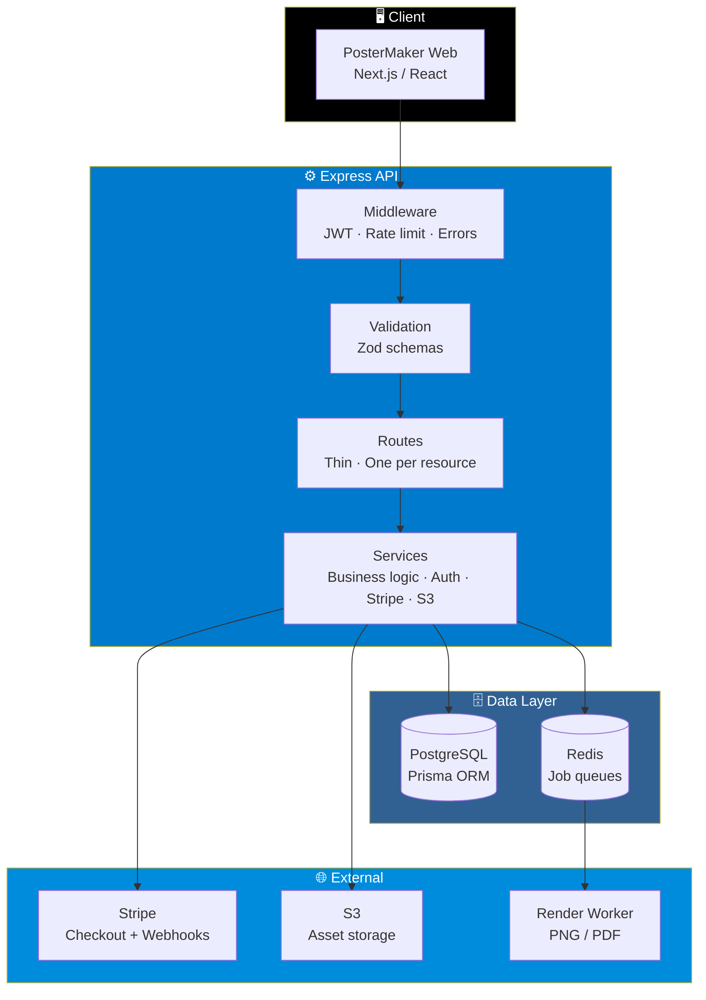

# 🎨 PosterMaker API

<div align="center">


**The backend for PosterMaker — a Node.js + TypeScript API.**

*Auth · Designs · Versions · Templates · Brand Kits · Uploads · Shares · Subscriptions · Payments · Teams*

[✨ Highlights](#-whats-here) • [🧠 Design Decisions](#-design-decisions-worth-knowing-about) • [🚀 Running It](#-running-it) • [🧪 Tests](#-tests) • [📝 Sandbox Note](#-a-note-on-this-sandbox)

</div>

---

## 📖 Overview

**PosterMaker API** is the backend service that powers PosterMaker — a design tool for creating posters, social graphics, and print materials.

It handles:

- **Authentication** — Argon2id passwords, JWT sessions
- **Design documents** — structured JSON stored alongside relational metadata
- **Versioning** — full design history with plan-gated retention
- **Templates** — free and Pro tiers with category browsing
- **Brand kits** — reusable colors, fonts, logos
- **Uploads** — S3-backed asset storage
- **Public sharing** — token-based links that never leak account data
- **Subscriptions & payments** — Stripe Checkout with webhook-confirmed upgrades
- **Teams** — multi-user collaboration on shared workspaces

### Core Idea

> **The API is the source of truth.**
>
> Plan limits, upgrade decisions, and export authorization are all enforced **server-side** — never trusted to the client.

---

## 📁 What's Here

```
api/
├── prisma/
│   ├── schema.prisma    Full relational schema (users, designs, versions, templates,
│   │                    brand kits, uploads, shares, subscriptions, payments, teams)
│   └── seed.ts          Demo template categories + two seed templates
│
├── src/
│   ├── index.ts         Express app: security middleware, route mounting
│   ├── routes/          One file per resource — thin, delegates to services
│   ├── services/        Business logic, authorization checks, Stripe, S3, plan limits
│   ├── middleware/      Auth (JWT), rate limiting, centralized error handling
│   └── validation/      Zod schemas — every request body is validated before it
│                        reaches a service
│
├── tests/               Vitest + supertest integration tests (auth, design CRUD,
│                        plan-limit enforcement)
│
├── docker-compose.yml   web + api + postgres + redis
└── .env.example
```

### Architecture at a Glance



### The Request Pipeline

Every request flows through the same disciplined layers:

1. **Security middleware** — CORS, helmet, body limits
2. **Auth middleware** — JWT verification, user lookup
3. **Rate limiting** — per-route limits
4. **Zod validation** — every request body is validated before it reaches a service
5. **Route handler** — thin, delegates immediately
6. **Service** — business logic and authorization
7. **Centralized error handler** — uniform error responses

---

## 🧠 Design Decisions Worth Knowing About

Every non-obvious choice in this API is deliberate. Here's the reasoning.

### 🔒 Plan Limits Are Enforced Server-Side

**Decision:** Plan gating lives in `services/plan.service.ts`, not in the UI.

**Why:**

- Hiding a button doesn't protect a feature
- Every route that touches a gated feature calls `assertFeature()` or `assertCanCreateDesign()` **before** doing anything

**What's gated:**

| Feature | Enforced by |
|---------|-------------|
| Pro templates | `assertFeature('pro_templates')` |
| High-res export | `assertFeature('high_res_export')` |
| Magic Resize | `assertFeature('magic_resize')` |
| Background removal | `assertFeature('background_removal')` |
| Version history retention | `assertFeature('version_history')` |
| Unlimited designs | `assertCanCreateDesign()` |

### 💳 Stripe Is the Only Place Plan Tier Changes

**Decision:** The client can *request* an upgrade; only Stripe can *confirm* it.

**How it works:**

1. `POST /api/subscription/checkout` creates a Stripe Checkout Session
2. The actual upgrade happens in the **webhook handler** (`services/billing.service.ts`)
3. Only after Stripe confirms payment does the plan tier change

> ⚠️ **Never on the client's say-so.** Ever.

### 📤 Exports Are Queued, Not Synchronous

**Decision:** Export requests return immediately. Rendering happens out of band.

**How it works:**

1. `POST /api/designs/:id/export` returns a **job id immediately** (HTTP `202 Accepted`)
2. The render job is pushed onto a **Redis list**
3. A separate worker process handles the actual rendering — PNG / PDF at full resolution

**Why:**

- The queue contract is what matters architecturally
- The API stays **responsive under load** instead of blocking on image rendering
- The render worker itself is intentionally out of scope for this scaffold — swapping in a real one is a drop-in addition

### 🔐 Passwords Use Argon2id

**Decision:** Argon2id over bcrypt.

**Why:**

- Argon2id is the **current recommended default** for new systems
- Resistant to GPU-accelerated cracking
- Won the Password Hashing Competition

### 📐 Design Documents Are Structured JSON

**Decision:** `Design.document` and `DesignVersion.document` store the full elements/background tree as JSON.

**What stays relational:**

- Owner
- Folder
- Format
- Favorite flag
- Timestamps
- Everything else you'd ever want to filter, sort, or join on

**Why:**

- Design documents are **naturally hierarchical** — JSON captures that cleanly
- But metadata should be **queryable and indexable** — relational tables handle that
- Best of both worlds, no document database required

### 🔗 Public Share Links Never Leak Account Data

**Decision:** `GET /api/shared/:token` returns only design geometry and content.

**What's never exposed:**

- The owner's email
- Internal user ids
- Internal design ids
- Anything not needed to render the design

**Why:**

- Sharing a design should be safe by default
- A leaked share link should never become a privacy incident

---

## 🚀 Running It

### Prerequisites

- Docker & Docker Compose
- *(or)* Node.js 18+ with local PostgreSQL and Redis

### The Fast Path

```bash
cp .env.example .env
docker compose up
```

This starts:

| Service | Port |
|---------|------|
| **PostgreSQL** | 5432 |
| **Redis** | 6379 |
| **API** | 4000 |
| **Web (placeholder)** | 3000 |

### Run Migrations & Seed

Once the containers are up:

```bash
# Apply the schema
docker compose exec api npx prisma migrate dev

# Seed demo data
docker compose exec api npx prisma db seed
```

---

## 🧪 Tests

```bash
npm test
```

Runs **Vitest + supertest** integration tests covering:

- Authentication flows
- Design CRUD
- Plan-limit enforcement

### ⚠️ Test Database Warning

Tests expect `DATABASE_URL` to point at a **disposable Postgres instance** with migrations applied.

**Point it at a throwaway database — never production.**

---

## 📝 A Note on This Sandbox

This scaffold was written and **partially type-checked in an offline sandbox**.

### What Ran Successfully

- ✅ `npm install`
- ✅ `tsc --noEmit` — caught real bugs, all of which are already fixed

### What Was Blocked

- ❌ `prisma generate` — its engine download was blocked by the sandbox's network allowlist

### What This Means

The **Prisma-client-dependent types** couldn't be fully verified in this environment.

That step needs a **normal internet connection** and will work as expected the first time you run either:

```bash
docker compose up
# or
npm install
```

…**outside this sandbox.**

> 💡 This is a known limitation of the sandbox environment, not a defect in the code.

---

## 🗄️ Database Schema

The Prisma schema covers the full domain:

| Model | Purpose |
|-------|---------|
| **User** | Accounts, Argon2id password hashes |
| **Design** | Structured JSON documents + relational metadata |
| **DesignVersion** | Full version history |
| **Template** | Free + Pro templates by category |
| **BrandKit** | Reusable colors, fonts, logos |
| **Upload** | S3-backed asset references |
| **Share** | Token-based public links |
| **Subscription** | Stripe-backed plan tiers |
| **Payment** | Payment records |
| **Team** | Multi-user collaboration |

See [`prisma/schema.prisma`](prisma/schema.prisma) for the full model.

---

## 🛠️ Tech Stack

| Layer | Technology |
|-------|-----------|
| **Runtime** | Node.js |
| **Language** | TypeScript |
| **Framework** | Express |
| **ORM** | Prisma |
| **Database** | PostgreSQL |
| **Queue** | Redis |
| **Validation** | Zod |
| **Auth** | JWT + Argon2id |
| **Payments** | Stripe (Checkout + Webhooks) |
| **Storage** | S3 |
| **Testing** | Vitest + supertest |

---

## 🗺️ Roadmap

### ✅ Current

- [x] Full Prisma schema (users, designs, versions, templates, brand kits, uploads, shares, subscriptions, payments, teams)
- [x] Express app with security middleware
- [x] Thin routes, service-layer business logic
- [x] JWT auth + Argon2id password hashing
- [x] Zod validation on every request body
- [x] Plan-limit enforcement server-side
- [x] Stripe Checkout + webhook-confirmed upgrades
- [x] Queued export contract (202 Accepted + Redis list)
- [x] Public share links with no account data leakage
- [x] Docker Compose (web + api + postgres + redis)
- [x] Vitest + supertest integration tests

### 🔜 Future Ideas

- [ ] Render worker process (PNG / PDF at full resolution)
- [ ] S3 signed-upload flow for client-side uploads
- [ ] Team invitation & permission model
- [ ] OpenAPI / Swagger documentation
- [ ] Rate-limit tuning per plan tier
- [ ] Audit log for admin actions
- [ ] Webhook retry & dead-letter handling
- [ ] Multi-region deployment guide

---

## 🤝 Contributing

Contributions are welcome. Please:

1. Fork the repository
2. Follow the existing layered architecture — routes stay thin, logic lives in services
3. Validate every request body with a Zod schema
4. **Enforce plan limits server-side** — never in the UI
5. Add tests for any new behavior
6. Submit a Pull Request

### Guidelines

- **Never trust the client** for plan tier, ownership, or feature access
- **Never upgrade a plan** outside the Stripe webhook
- **Never block on rendering** — queue it
- **Never leak account data** through share links
- **Never skip validation** — Zod schema on every request body

---

## 📜 License

MIT — see [LICENSE](LICENSE) for details.

---

<div align="center">

### 🎨 THE API BEHIND THE CANVAS

**Server-side truth. Queued renders. Webhook-confirmed upgrades.**

<br>

⭐ If this project helped you, consider giving it a star.

<br>

[⬆ Back to Top](#-postermaker-api)

</div>
